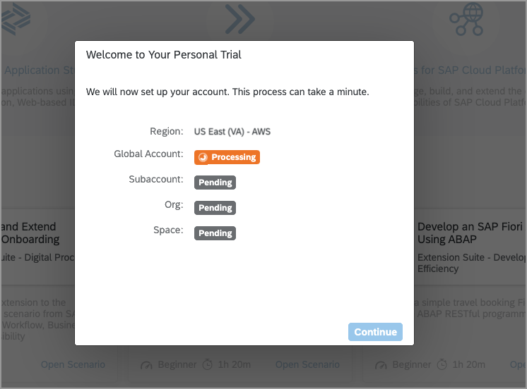
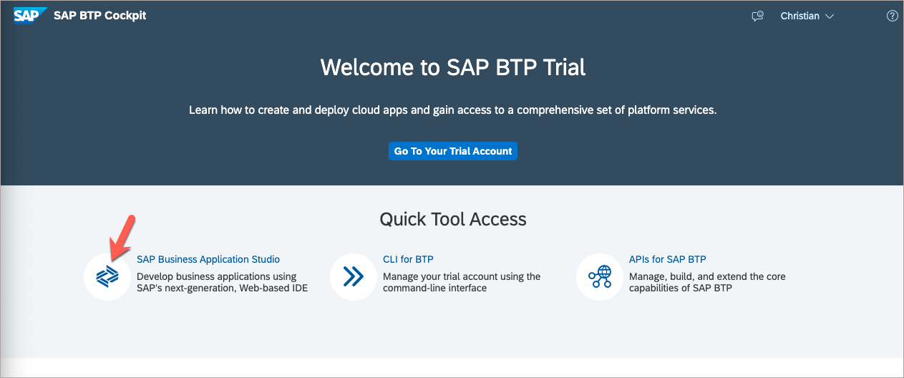
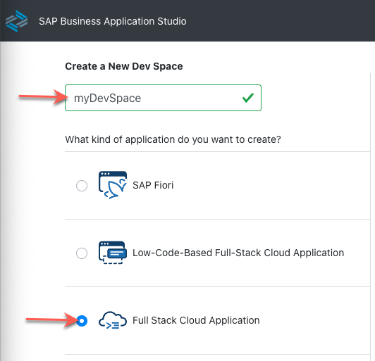
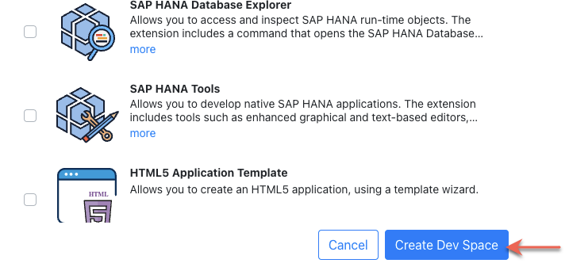
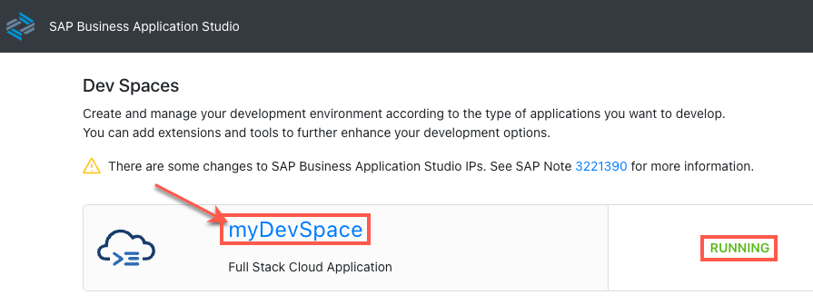
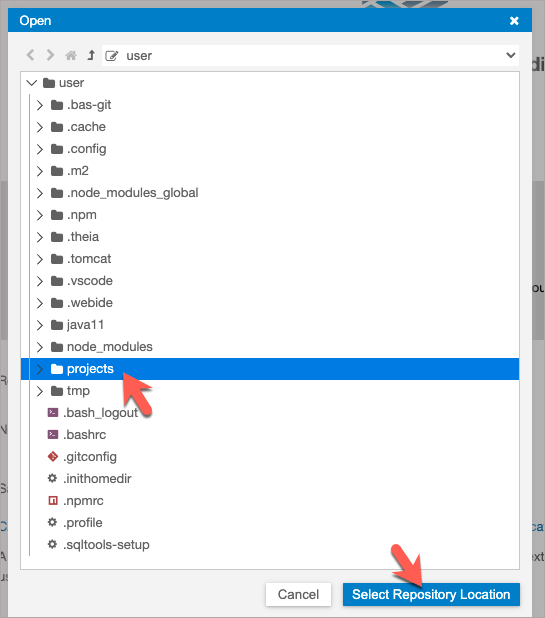
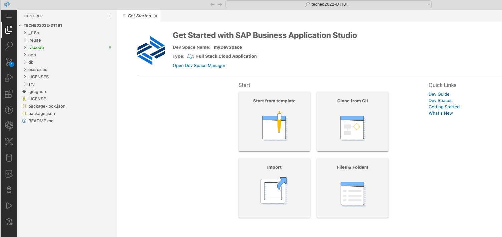

# Getting Started - Setting up your Development Environment

Welcome to the workshop **DT181 - Boost Your Productivity in Developing SAP Fiori Apps**.\
This workshop will guide you step-by-step through the process of creating a **SAPUI5 custom app** and blending it with the **SAP Fiori Elements Flexible Programming Model** which is available with SAP Fiori elements floorplans for OData V4.\
Based on a **SAP Cloud Application Programming Model** service equipped with basic annotations, you will learn how to assemble your custom design from SAP Fiori Elements Building Blocks and leverage Controller Extensions with the help of **SAP Fiori tools** and the **SAP Fiori Elements Flexible Programming Model**.

## Setting up Business Application Studio in an SAP SAP Business Technology Platform Trial Account

If you don't have an **SAP BTP account** already, you can create your own [here](https://www.sap.com/products/cloud-platform/get-started.html).

### New Trial Users

After having registered your new user, start your trial via [this link](https://account.hanatrial.ondemand.com/register)\
At first time log in, you'll be asked to select your preferred region.
This will start the set-up of your account.



Your subaccount, org and space is created automatically, along with the necessary role configurations and subscriptions.\
When done, the subaccount overview page is shown.

### Existing Trial Users

Depending on when you created the SAP BTP Trial account, the subscription to **SAP Business Application Studio** might already be added in the subaccount.\
If you are not subscribed to SAP Business Application Studio, follow [this step](https://developers.sap.com/tutorials/appstudio-onboarding.html#005500bf-bf4a-44cb-bbef-f2221d061b5c) to add the subscription to a subaccount.


### Accessing SAP Business Application Studio

Click on the Quick Tool Access icon **SAP Business Application Studio**.



## Creating the Development Space

Click on the button **Create Dev Space**.


Enter a name for your development space and select application profile **Full Stack Cloud Application**.



In the lower right corner of the page press button **Create Dev Space**.

<br>

Once your development space has status running, click on the development space name to open it.



## Getting the Sample Scenario

Get the GitHub repository clone Https Url from the repository's [landing page](https://github.com/SAP-samples/teched2022-DT181).\
Click on button **Code**, then click the copy icon.


In the dev space, you will see a **Welcome Page**.\
Click on tile **Clone from Git**.


Alternatively, you can go via menu **View->Find Command...** and search for command **git clone**.


Paste the repository link into the input field.

```abap
https://github.com/SAP-samples/teched2022-DT181.git
```


If asked, select repository location.



When the cloning is finished, open the cloned repository.


Alternatively, you can open a workspace via the file menu.


Select folder path **/home/user/projects/teched2022-DT181/** and click **Ok**. This will restart SAP Business Application Studio.


In the **Explorer** pane on the left side of SAP Business Application Studio, you can see the workspace content.



## Summary

With the setup procedure done, you now have completed:

- Setting up the SAP Business Technology Platform trial account
- Access to SAP Business Application Studio
- Creation of your development space
- Setting up the sample OData V4 service in SAP Business Application Studio

Continue to - [Exercise 1 - Generating an SAP Fiori Elements App](../ex1/README.md)
