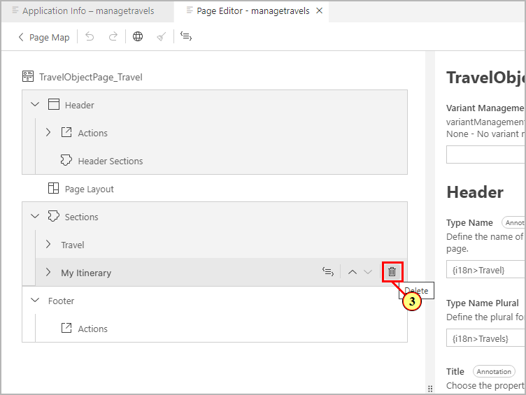
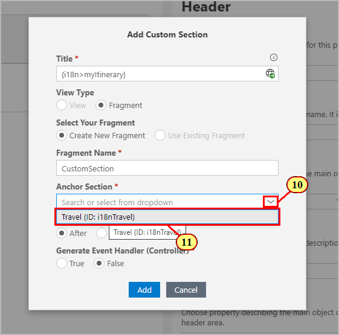
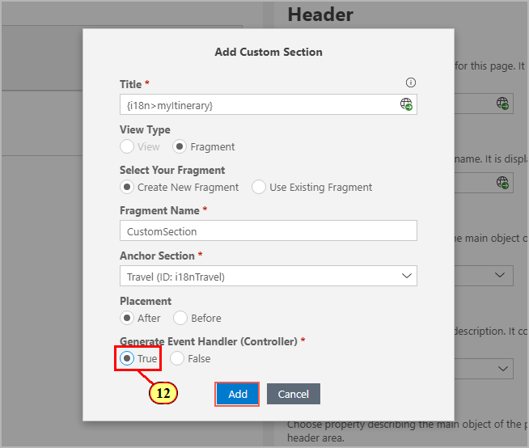
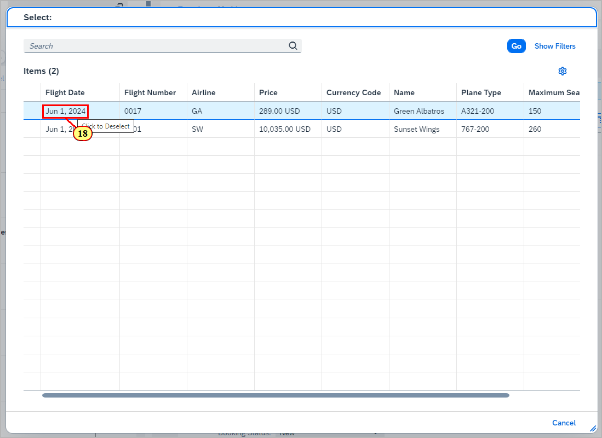

# Exercise 6 - Flexible Programming Model: Extending the Object Page with a Custom Section and Building Blocks

In this exercise, we will combine UI5 freestyle controls with Fiori elements building blocks in a custom section.\
With the **table building block**, we get the same behaviour and looks of the replaced table section\
in a Fiori elements extension point freestyle context.

## Exercise 6.1 Remove existing Section via Page Map

The **SAP Fiori tools Page Map** provides several ways of configuring the app and also allows to add and remove UI elements.\
\(1\) In the SAP Business Application Studio, click the corresponding tile on the **Application Info** tab in order to open the SAP Fiori tools Page Map.


(2) On the SAP Fiori tools Page Map tile **Object Page**, click icon **Configure Page** .


(3) In the Page Editor for the object page, expand **Sections**.\
\(3\) For section **My Itinerary**, click icon **Delete** .



(4) Confirm by clicking button .


In the preview browser tab of the app, verify that the object page booking table section is not visible anymore.

## Exercise 6.2 Adding a Custom Section via Page Map

(5) In the Page Editor, click icon   (**Add Sections**) in the top right corner of area **Sections**.


(6) In the combo box, select .


In the dialog **Add Custom Section**, enter title **My Itinerary**.\
(7) On the right end of the **Title** input field, click icon .


(8) In the dialog, Click button .


(9) Enter as Fragment Name: **CustomSection**.


(10)Open the drop-down **Target Facet/Section**.

(11) Select .



In combination with the Section Position (we leave it to **After**),\
this defines where the custom section should be located on the Object Page.

(12) Set **Generate Event Handler (Controller)** to **true** and confirm dialog by clicking button **Add**.



## Exercise 6.3 Replace Generated XML Fragment Content

(13) Click  icon **Navigate to source code** .\


(14) This will open up a new tab showing the content of the **generated xml fragment**.


 Replace the content of file **CustomSection.fragment.xml** with the following xml snippet:

 ```js
<core:FragmentDefinition
  xmlns:core='sap.ui.core'
  xmlns='sap.m'
  xmlns:l='sap.ui.layout'
  xmlns:macros='sap.fe.macros'
>
 <VBox core:require="{handler: 'sap/fe/cap/managetravels/ext/fragment/CustomSection'}">  
  <MessageStrip
    text='All bookings for travel {TravelID} got confirmed by the agency.'
    showIcon='true'
    class='sapUiSmallMarginBottom'>
  </MessageStrip>     
  <l:Grid hSpacing='1' containerQuery='true'
    defaultSpan='L12 M12 S12'>
   <l:content>
   <macros:Table metaPath='to_Booking/@com.sap.vocabularies.UI.v1.LineItem'
      id='bookingTable'/>
   </l:content>
  </l:Grid>
 </VBox>
</core:FragmentDefinition>
```

(15) The xml fragment combines a SAPUI5 MessageStrip control with the building block **Table** from namespace **sap.fe.macros**.\
Only two properties are defined:

- the table control's **identifier**
- **metaPath** defining the relative path from the current page's context (entity **Travel**) to the **LineItem** annotation of the\
   associated entity **Booking** (via association **'to_Booking/@com.sap.vocabularies.UI.v1.LineItem'**).


## Exercise 6.4 Testing the Building Block Table

Switch to the preview browser tab of the app.\
The object page now shows the custom section with the message strip control and the table building block.\
We will now check whether it behaves exactly as the original booking table from the object page section that was replaced.

(16) Click button **Edit** .


We can see that the table building block follows the edit state of the page.\
Let us check whether the edit flow is also working as expected.\
(17) Open the input help for field **Flight Number** via icon **.


(18) In the Value Help dialog, Select a list entry.



(19) In the footer bar, a notification shows that the draft has been automatically updated.


(20) Click button .


The table switches again to display mode, following the page's edit state.


## Summary

You've now successfully ....

Continue to - [Exercise 7 - Guided Development: Adding a Chart Building Block](../ex7/README.md)
