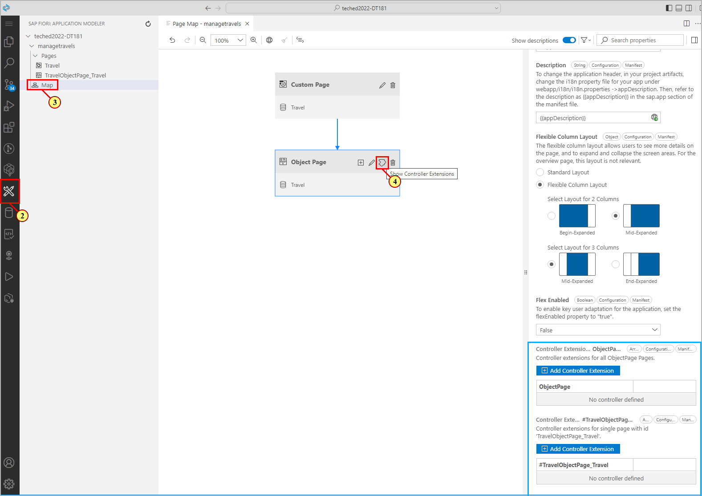
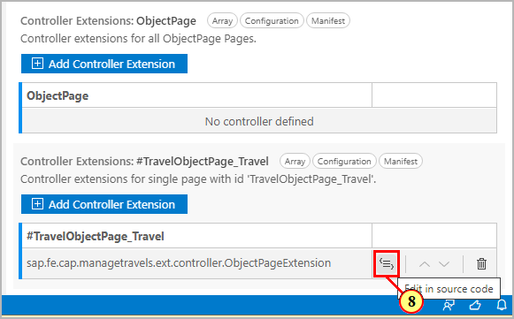
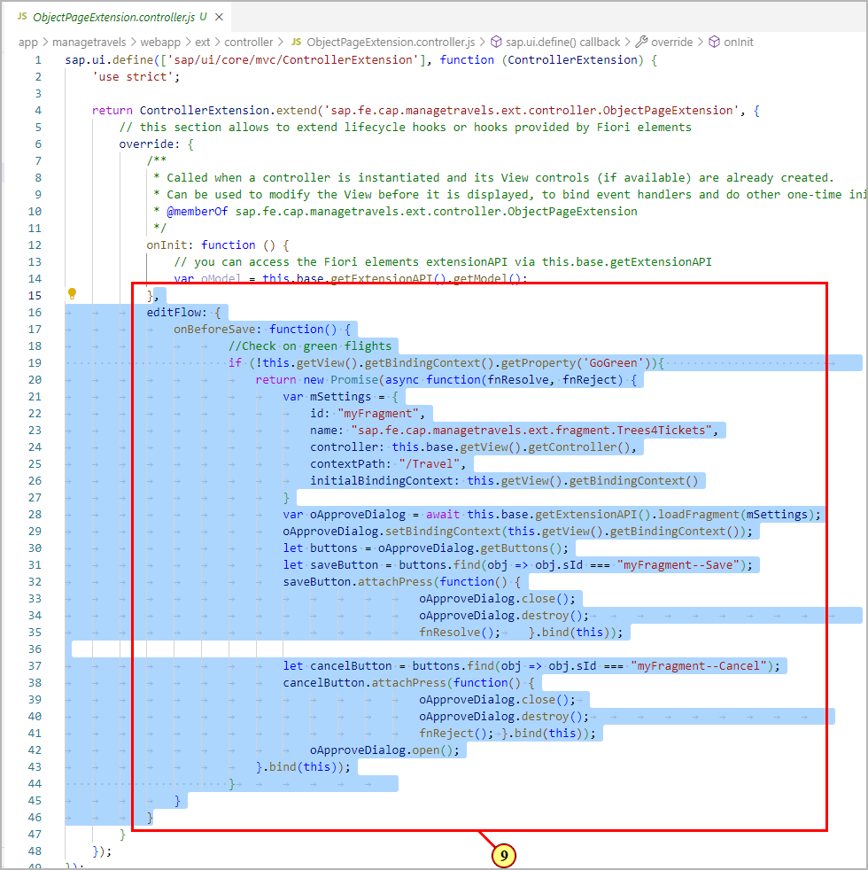
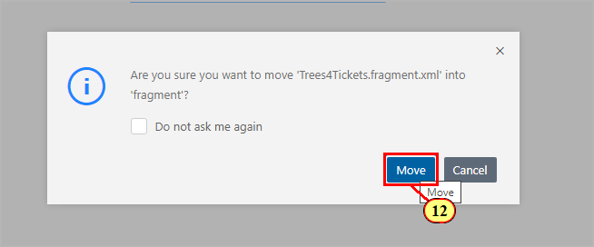
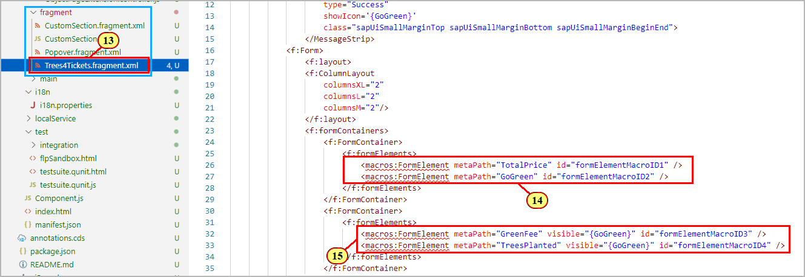
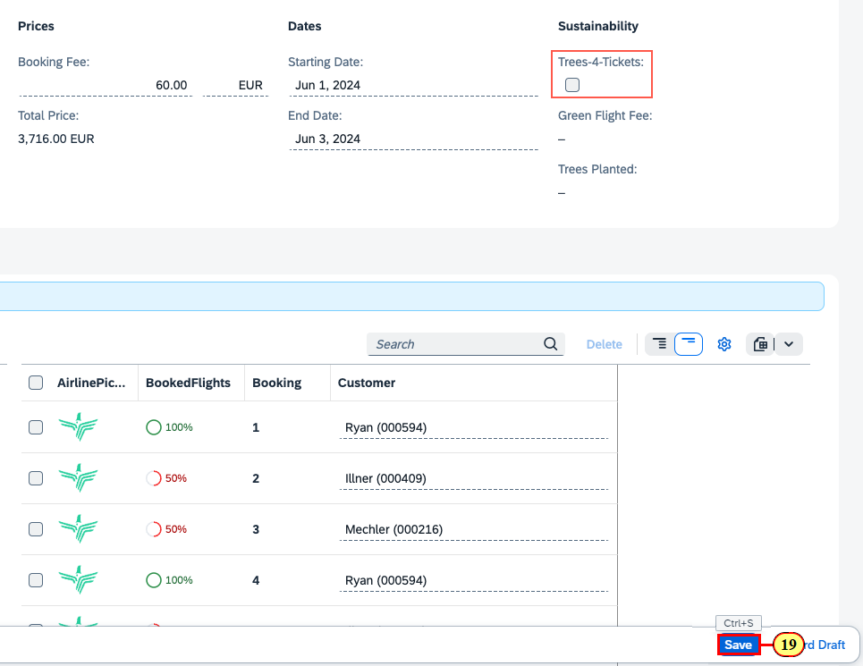
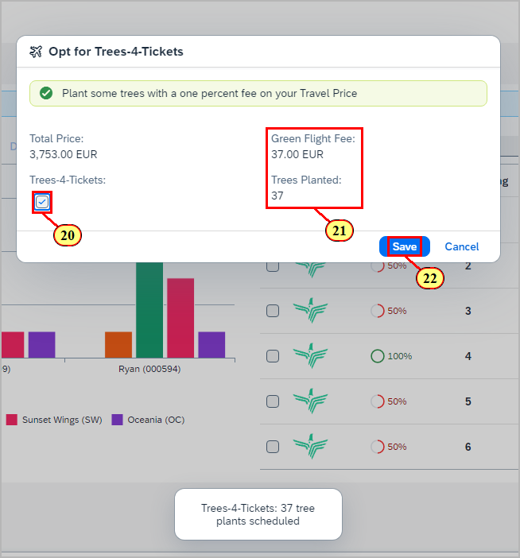
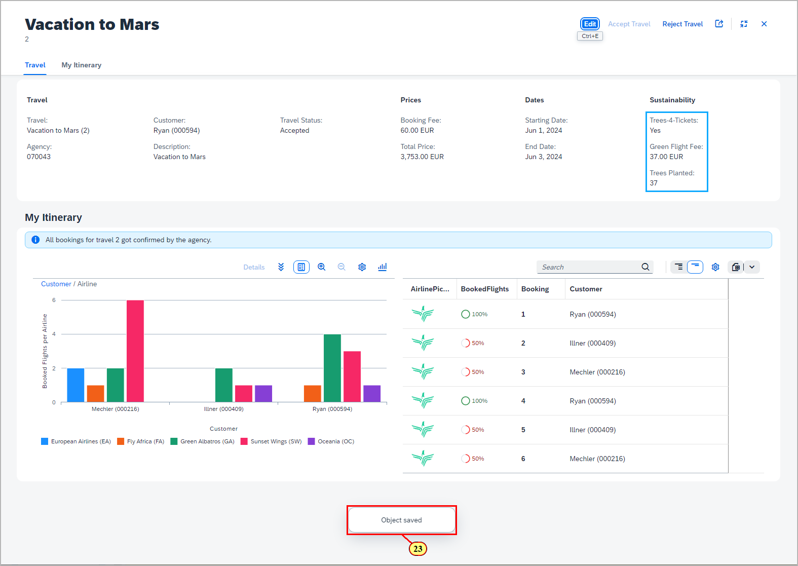

# Exercise 8 - Page Map: Adding a Controller Extension

In this exercise we will learn how to change the **edit flow** of an app by implementing a controller extension for the object page with support of the SAP Fiori Page Map.\
In order to promote the new **green flight offering**, we will intercept the **save action** by overriding function **onBeforeSave** of the\
**edit flow API**, and execute some custom code in order to check whether Trees-4-Tickets has been selected for the travel.\
Additionally, we will make usage of the **form element building block** in order to display a form in a save dialog.

(1) For further details, the Flexible Programming Model Explorer provides detailed [guidance](https://ui5.sap.com/test-resources/sap/fe/core/fpmExplorer/index.html#/controllerExtensions/controllerExtensionsOverview/guidanceControllerExtensions) on how to register and implement a controller extension.


## Exercise 8.1 - Using the Page Map to Add a Controller Extension

(2) In the Application Studio toolbar, click the SAP Fiori icon .

(3) Click  to open the SAP Fiori Page Map.

(4) On the **object page** tile click icon **Show Controller Extensions** .



The Page Map supports the creation of controller extensions overriding all object page controllers globally, or only specific object page instances.\
We will create a specific controller extension for our travel object page.

(5) Click .


The **Add Controller Extension Dialog** is opened.\
(6)  Insert **ObjectPageExtension** as **Controller Name** 
(7) confirm by clicking .


(8) Click icon **Edit in source code**  to open up the generated controller extension file.



(9) In the controller file, below function **onInit()** add the following code which overrides the **editFlow API** function **onBeforeSave**:

```js
,
editFlow: {
	onBeforeSave: function() {
			//Check on green flights
			if (!this.getView().getBindingContext().getProperty('GoGreen')){                        	
				return new Promise(async function(fnResolve, fnReject) {
					var mSettings = {
						id: "myFragment",
						name: "sap.fe.cap.managetravels.ext.fragment.Trees4Tickets",
						controller: this.base.getView().getController(),
						contextPath: "/Travel",
						initialBindingContext: this.getView().getBindingContext()
					}
					var oApproveDialog = await this.base.getExtensionAPI().loadFragment(mSettings);
					oApproveDialog.setBindingContext(this.getView().getBindingContext());
					let buttons = oApproveDialog.getButtons();
					let saveButton = buttons.find(obj => obj.sId === "myFragment--Save");
					saveButton.attachPress(function() {
										oApproveDialog.close();
										oApproveDialog.destroy();										
										fnResolve();	}.bind(this));

					let cancelButton = buttons.find(obj => obj.sId === "myFragment--Cancel");
					cancelButton.attachPress(function() {
										oApproveDialog.close();	
										oApproveDialog.destroy();									
										fnReject();	}.bind(this));
						oApproveDialog.open();
				}.bind(this));
			}						
	}
}
```


The override function is called when pressing the Save button on the object page, allowing to intercept the save event and show a custom dialog. \



For more examples on overriding the edit flow API, you can check the [Flexible Programming Model Explorer](https://sapui5.hana.ondemand.com/test-resources/sap/fe/core/fpmExplorer/index.html#/controllerExtensions/controllerExtensionsOverview/basicExtensibility).

## Exercise 7.2 Move XML Fragment to App Folder

The **xml fragment** containing the dialog definition is provided with the project.\
We need to move it to the corresponding app's sub folder in order to make usage of it:

Open project folder **app/test-resources/ext/fragment**.\
Drag and drop file **Trees4Tickets.fragment.xml** (10) to folder **app/managetravels/webapp/ext/fragment** (11).


(12) Confirm by clicking .



The XML fragment (13) defines a dialog containing some UI5 controls and two buttons for saving and canceling.\
The most interesting part is the **form element building block** used in (14) and (15).

- with property **metaPath** pointing to a property of the current binding context, we can show the property as a form field, having the same behaviour as a standard field.
- property **visible** shows and hides the form elements depending on the property path value. We are using boolean property **GoGreen** for that purpose, which is set when the checkbox is selected.



(16) Open file **app/manifest.json**.\
(17 ) Scroll to section **extends** where the controller extension is defined.\
Please note how the specific instance of the object page controller is overriden:\
the ID is constructed by using the pattern **YourApplicationID::ComponentID**


(18) Switch to the preview browser tab and click .


(19) Make sure that the **Trees-4-Tickets** flag is not set in the sustainability field group, then press .



The dialog is shown.\
(20) Select check box **Trees-4-Tickets**.\
the draft is automatically updated in the background.

(21) Additional form fields with updated data are shown.

(22) Click .



(23) The object is saved and the UI switches back to display mode.




## Summary

You've now successfully completed the hands-on workshop. Congratulations!
